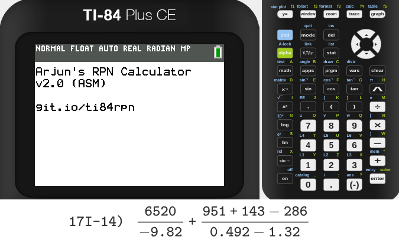
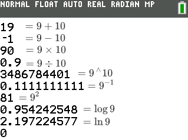
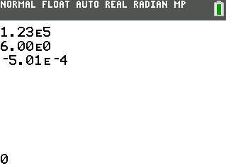
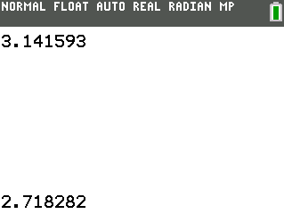
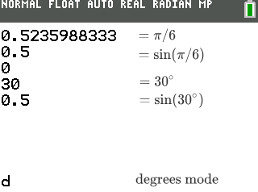

# RPN-Ti84

### Advanced Reverse Polish Notation entry program for the Ti-84+CE calculators



Designed for the UIL Texas Calculator Applications competition, where the raw speed of Reverse Polish Notation combined with the familiarity of a Ti-84+CE can provide a significant competitive advantage.

### Building and Installing

```shell
make #compiles .8xp file
tilp bin/RPN2ASM.8xp #transfers to calculator
```

### Features

| **Real Arithmetic Functions**<br /> | Scientific Notation<br />         |
| ------------------------------------------------------------ | ------------------------------------------------------------ |
| **Constants**<br />                | **Degrees/Radians Trigonometry**<br /> |

- Infinite stack
- Easy line editing
- Extensible code
- and many more